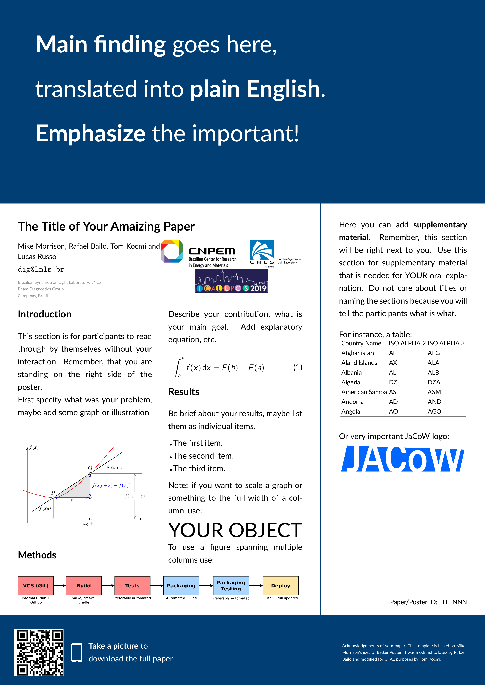

# Better Poster Latex Template

The **Better Poster** is [Mike Morrison](https://twitter.com/mikemorrison)'s response to the traditional academic poster. In his own words:
> Every field in science uses the same, old, wall-of-text poster design. If we can improve the knowledge transfer efficiency of that design even by a little bit, it could have massive ripple effects on all of science.
>
> Also, poster sessions tend to suck, so here's my pitch to make them more efficient AND more fun with a new approach to designing scientific posters/academic posters that is both more usable, and easier to create!

 - If you want to learn more about the reasons behind the design and how it improves upon more typical academic poster templates, I recommend Mike's [video](https://www.youtube.com/watch?v=1RwJbhkCA58&feature=youtu.be).
 - If you want to see how people are using the Better Poster design, see [#betterposter](https://twitter.com/hashtag/betterposter?src=hash) on twitter.

<kbd>

</kbd>

## Dependencies

In order to use the makefile you need rsvg-convert. You can install it by:

```bash
sudo apt install librsvg2-bin
```

## Documentation
The template has been implemented as a LaTeX class, `betterposter.cls`. You can load it into your `tex` file by using the command
```
\documentclass{betterposter}
```

### The `\betterposter` command

The main command provided by the `betterposter` class is `\betterposter`. The command takes three arguments: the content of the central, left and right columns, respectively. You type  the content in, and the command takes care of the formatting.
```
\betterposter{
% content of the main column
}{
% content of the left column
}{
% content of the right column
}
```

### The `\maincolumn` command

The `\maincolumn` command takes care of the formatting of the main column. It takes two arguments: the content of the main section (for the main point of the poster), and the content of the bottom section (destined for the QR code).
```
\maincolumn{
% main point of the poster
}{
% QR code
}
```

### Class Options

The `betterposter` class accepts three options which change the paper size:
 - `a0paper`, for A0, the default size.
 - `a1paper`, for A1.
 - `a2paper`, for A2.

These options behave like the usual LaTeX class options, for instance:
```
\documentclass[a0paper]{betterposter}
```

#### Other Class Options
The `betterposter` class extends the basic `article` class. Any options you give `betterposter`, other than the ones mentioned above, will be passed directly to `article`. For instance,
```
\documentclass[a0paper,fleqn]{betterposter}
```
will let `betterposter` deal with the `a0paper` option, but will pass `fleqn` directly to `article`.

### Custom Formatting Options
These commands should be placed before `\begin{document}`.

#### Column Width
You can customise the width of the columns:
 - The left column, `\setlength{\leftbarwidth}{value}`.
 - The right column, `\setlength{\rightbarwidth}{value}`.
 - The main column automatically resizes to the rest of the space available.

#### Column Margins
You can change the margins of the columns:
 - The vertical margin of the side columns, `\setlength{\columnmarginvertical}{value}`.
 - The horizontal margin of the side columns, `\setlength{\columnmarginhorizontal}{value}`.
 - The vertical margin of the side columns, `\setlength{\maincolumnmarginvertical}{value}`.
 - The horizontal margin of the side columns, `\setlength{\maincolumnmarginhorizontal}{value}`.

#### Font Sizes
The `\fontsize` command takes two arguments, the `size` (the size of the font in `pt`) and the `baselineskip` (usually you want `baselineskip` to be roughly 1.25 times the `size`.

You can change specific font sizes:
 - The text font, `\renewcommand{\fontsizestandard}{\fontsize{28}{35} \selectfont}`.
 - The main column font, `\renewcommand{\fontsizemain}{\fontsize{28}{35} \selectfont}`.
 - The title font, `\renewcommand{\fontsizetitle}{\fontsize{28}{35} \selectfont}`.
 - The author font, `\renewcommand{\fontsizeauthor}{\fontsize{28}{35} \selectfont}`.
 - The section font, `\renewcommand{\fontsizesection}{\fontsize{28}{35} \selectfont}`.

Additionally, you can change the font size of a specific text segment by placing the text in brackets as:
```
{\fontsize{28}{35} \selectfont Your text goes here}
```

#### Colours

The class defines the theme colours of the original design:
 - `empirical`:  `(0,77,64)`,
 - `theory`:  `(26,35,126)`,
 - `methods`:  `(140,22,22)`,
 - `intervention`:  `(255,213,79)`,

as well as `imperialblue`:  `(0,62,116)`.

You can change the background and the font colours:
 - Background of side columns, `\renewcommand{\columnbackgroundcolor}{black}`.
 - Font of side columns, `\renewcommand{\columnfontcolor}{gray}`.
 - Background of main column, `\renewcommand{\maincolumnbackgroundcolor}{empirical}`.
 - Font of main column, `\renewcommand{\maincolumnfontcolor}{gray}`.

### Vertical layout

Quickly transform poster to vertical layout by removing `landscape' from documentclass definition

### Class Options

The `betterposter` class accepts three options which change the paper size:
 - `a0paper`, for A0, the default size.
 - `a1paper`, for A1.
 - `a2paper`, for A2.

These options behave like the usual LaTeX class options, for instance:
```
\documentclass[a0paper]{betterposter}
```

## Acknowledgements

Mike Morrison - Author of **Better Poster** design

Rafael Bailo - design imported to latex

Tom Kocmi - modified for UFAL purposes, added vertical design
